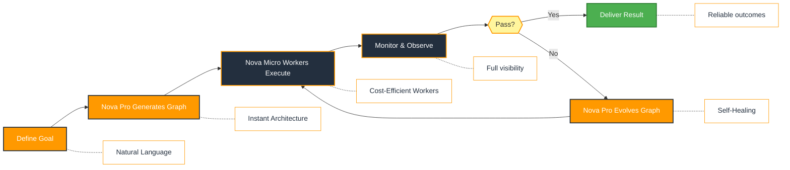
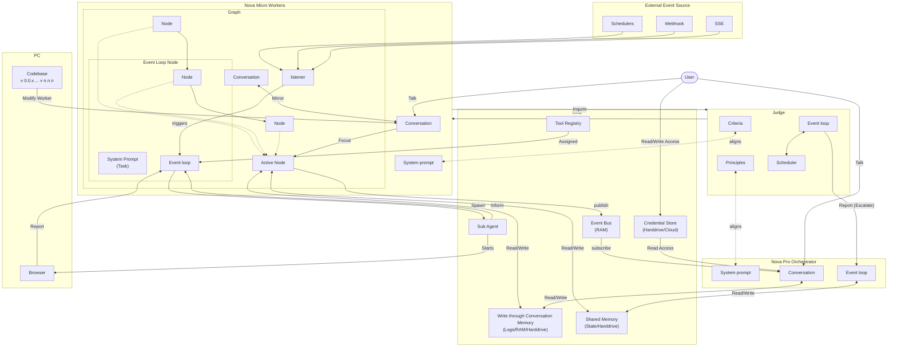

<p align="center">
  
</p>

<p align="center">
  <a href="README.md">English</a> |
  <a href="docs/i18n/zh-CN.md">简体中文</a> |
  <a href="docs/i18n/es.md">Español</a> |
  <a href="docs/i18n/hi.md">हिन्दी</a> |
  <a href="docs/i18n/pt.md">Português</a> |
  <a href="docs/i18n/ja.md">日本語</a> |
  <a href="docs/i18n/ru.md">Русский</a> |
  <a href="docs/i18n/ko.md">한국어</a>
</p>

<p align="center">
  <a href="LICENSE"></a>
  
</p>

<p align="center">
  
  
  
  
  
</p>
<p align="center">
  
  
  
</p>

## Overview

Nova Nexa is an enterprise AI operations framework powered by Amazon Nova. Describe your business process in natural language ("manage my customer onboarding pipeline"), and the framework generates a full agent graph, deploys it, monitors failures using Nova's reasoning, and rewrites failing nodes automatically.

The architecture uses a two-tier Amazon Nova strategy:
- **Nova Pro (Orchestrator)** — drives the coding agent for graph generation, failure reasoning, and self-healing with extended context for holding the full agent graph and failure history in memory
- **Nova Micro (Workers)** — powers high-throughput worker nodes for cost-efficient execution at scale

When things break, the framework captures failure data, evolves the agent through the Nova Pro orchestrator, and redeploys. Built-in human-in-the-loop nodes, credential management, and real-time monitoring give you control without sacrificing adaptability.

## Who Is Nova Nexa For?

Nova Nexa is designed for developers and teams who want to build **production-grade AI agents** powered by Amazon Nova without manually wiring complex workflows.

Nova Nexa is a good fit if you:

- Want AI agents that **execute real business processes**, not demos
- Need **fast or high volume agent execution** with Nova Micro cost efficiency
- Need **self-healing and adaptive agents** that improve over time using Nova Pro reasoning
- Require **human-in-the-loop control**, observability, and cost limits
- Plan to run agents in **production environments** on AWS infrastructure

Nova Nexa may not be the best fit if you're only experimenting with simple agent chains or one-off scripts.

## When Should You Use Nova Nexa?

Use Nova Nexa when you need:

- Long-running, autonomous agents powered by Amazon Nova
- Strong guardrails, process, and controls
- Continuous improvement based on failures with Nova Pro reasoning
- Multi-agent coordination with cost-optimized Nova Micro workers
- A framework that evolves with your goals

## Amazon Nova Integration

Nova Nexa deeply integrates Amazon Nova at every layer:

| Layer | Model | Purpose |
|-------|-------|---------|
| Orchestrator (formerly Queen) | **Nova Pro** | Graph generation, failure reasoning, self-healing, extended context for full agent graph + failure history |
| Worker Nodes | **Nova Micro** | High-throughput task execution, cost-efficient at scale |
| Context Management | **Nova Pro Extended** | Holds complete agent graph and failure history in memory for informed decision-making |
| Fallback/Specialty | **Nova Lite** | Lightweight tasks, classification, routing decisions |

## Quick Links

- **[Documentation](docs/)** - Complete guides and API reference
- **[Changelog](CHANGELOG.md)** - Latest updates and releases
- **[Roadmap](docs/roadmap.md)** - Upcoming features and plans
- **[Contributing](CONTRIBUTING.md)** - How to contribute and submit PRs

## Quick Start

### Prerequisites

- Python 3.11+ for agent development
- AWS account with Amazon Bedrock access (Nova Pro and Nova Micro enabled)
- **ripgrep (optional, recommended on Windows):** The `search_files` tool uses ripgrep for faster file search.

> **Note for Windows Users:** It is strongly recommended to use **WSL (Windows Subsystem for Linux)** or **Git Bash** to run this framework.

### Installation

```bash
# Clone the repository
git clone https://github.com/nova-nexa/nova-nexa.git
cd nova-nexa

# Run quickstart setup
./quickstart.sh
```

This sets up:

- **framework** - Core agent runtime and graph executor (in `core/.venv`)
- **nexa_tools** - MCP tools for agent capabilities (in `tools/.venv`)
- **credential store** - Encrypted API key storage (`~/.nova-nexa/credentials`)
- **LLM provider** - Amazon Nova model configuration via Bedrock
- All required Python dependencies with `uv`

> **Tip:** To reopen the dashboard later, run `nexa open` from the project directory.

### Build Your First Agent

Type the agent you want to build in the home input box. The Nova Pro orchestrator will design the agent graph, generate the code, and validate it.

### Run Agents

Select an agent and click Run. The Nova Pro orchestrator manages the lifecycle while Nova Micro workers execute the tasks cost-efficiently.

## Features

- **Browser-Use** - Control the browser on your computer to achieve hard tasks
- **Parallel Execution** - Execute the generated graph in parallel with Nova Micro workers completing jobs concurrently
- **[Goal-Driven Generation](docs/key_concepts/goals_outcome.md)** - Define objectives in natural language; the Nova Pro orchestrator generates the agent graph and connection code
- **[Adaptiveness](docs/key_concepts/evolution.md)** - Framework captures failures, calibrates using Nova Pro reasoning, and evolves the agent graph
- **[Dynamic Node Connections](docs/key_concepts/graph.md)** - No predefined edges; connection code is generated by Nova based on your goals
- **SDK-Wrapped Nodes** - Every node gets shared memory, local RLM memory, monitoring, tools, and LLM access out of the box
- **[Human-in-the-Loop](docs/key_concepts/graph.md#human-in-the-loop)** - Intervention nodes that pause execution for human input with configurable timeouts and escalation
- **Real-time Observability** - WebSocket streaming for live monitoring of agent execution, decisions, and node-to-node communication
- **Production-Ready** - Self-hostable, built for scale and reliability on AWS

## Integration

Nova Nexa is built to leverage Amazon Nova's full model family while remaining system-agnostic for tools.

- **LLM Strategy** - Nova Pro for orchestration and reasoning, Nova Micro for high-throughput workers, with fallback to Nova Lite for lightweight tasks. Additional providers supported through LiteLLM for flexibility.
- **Business system connectivity** - Connect to all kinds of business systems as tools: CRM, support, messaging, data, file, and internal APIs via MCP.

## Why Nova Nexa

Nova Nexa focuses on generating agents that run real business processes using Amazon Nova's differentiated reasoning. Instead of requiring you to manually design workflows, define agent interactions, and handle failures reactively, Nova Nexa flips the paradigm: **you describe outcomes, and the system builds itself** — delivering an outcome-driven, adaptive experience with Nova's multi-model intelligence.



### The Nova Nexa Advantage

| Traditional Frameworks     | Nova Nexa                                          |
| -------------------------- | -------------------------------------------------- |
| Hardcode agent workflows   | Describe goals in natural language                  |
| Manual graph definition    | Nova Pro auto-generates agent graphs                |
| Reactive error handling    | Nova Pro reasoning for self-healing                 |
| Single model, one cost     | Nova Pro (orchestrator) + Nova Micro (workers) = cost control |
| Static tool configurations | Dynamic SDK-wrapped nodes                           |
| Separate monitoring setup  | Built-in real-time observability                    |
| DIY budget management      | Integrated cost controls & model degradation        |
| Limited context window     | Nova Pro extended context for full graph + history  |

### How It Works

1. **[Define Your Goal](docs/key_concepts/goals_outcome.md)** → Describe what you want to achieve in plain English
2. **Nova Pro Orchestrator Generates** → Creates the [agent graph](docs/key_concepts/graph.md), connection code, and test cases
3. **[Nova Micro Workers Execute](docs/key_concepts/worker_agent.md)** → SDK-wrapped nodes run with full observability and tool access at low cost
4. **Control Plane Monitors** → Real-time metrics, budget enforcement, policy management
5. **[Nova Pro Self-Heals](docs/key_concepts/evolution.md)** → On failure, Nova Pro reasons about the failure, evolves the graph, and redeploys automatically

## Architecture



## Contributing
We welcome contributions from the community! Please see [CONTRIBUTING.md](CONTRIBUTING.md) for guidelines.

1. Find or create an issue and get assigned
2. Fork the repository
3. Create your feature branch (`git checkout -b feature/amazing-feature`)
4. Commit your changes (`git commit -m 'Add amazing feature'`)
5. Push to the branch (`git push origin feature/amazing-feature`)
6. Open a Pull Request

## Security

For security concerns, please see [SECURITY.md](SECURITY.md).

## License

This project is licensed under the Apache License 2.0 - see the [LICENSE](LICENSE) file for details.

## Frequently Asked Questions (FAQ)

**Q: What LLM providers does Nova Nexa support?**

Nova Nexa is optimized for Amazon Nova (Pro, Micro, Lite) via Amazon Bedrock. It also supports 100+ additional LLM providers through LiteLLM integration for flexibility, including OpenAI, Anthropic, Google Gemini, and more.

**Q: Why Amazon Nova specifically?**

Nova Nexa uses a two-tier model strategy: Nova Pro's extended context and reasoning capabilities power the orchestrator (graph generation, failure analysis, self-healing), while Nova Micro provides cost-efficient high-throughput execution for worker nodes. This gives you the best of both worlds — intelligence where it matters, cost control where it counts.

**Q: Can I use Nova Nexa with other models?**

Yes. While optimized for Amazon Nova, the framework supports any LiteLLM-compatible model. You can mix Nova with other providers for specific nodes if needed.

**Q: What makes Nova Nexa different from other agent frameworks?**

Nova Nexa generates your entire agent system from natural language goals using a Nova Pro-powered orchestrator — you don't hardcode workflows or manually define graphs. When agents fail, Nova Pro reasons about the failure, evolves the agent graph, and redeploys. This self-improving loop, combined with Nova Micro's cost efficiency for workers, is unique.

**Q: Is Nova Nexa open-source?**

Yes, Nova Nexa is fully open-source under the Apache License 2.0.

**Q: Can Nova Nexa handle complex, production-scale use cases?**

Yes. Nova Nexa is designed for production with automatic failure recovery via Nova Pro reasoning, real-time observability, cost controls through Nova Micro workers, and horizontal scaling support.

**Q: Does Nova Nexa support human-in-the-loop workflows?**

Yes, Nova Nexa fully supports [human-in-the-loop](docs/key_concepts/graph.md#human-in-the-loop) workflows through intervention nodes that pause execution for human input with configurable timeouts and escalation policies.

**Q: How does cost control work in Nova Nexa?**

Nova Nexa provides granular budget controls including spending limits, throttles, and automatic model degradation. The two-tier Nova strategy (Pro for orchestration, Micro for workers) inherently optimizes costs. You can set budgets at the team, agent, or workflow level.

**Q: What programming languages does Nova Nexa support?**

The Nova Nexa framework is built in Python. A JavaScript/TypeScript SDK is on the roadmap.

---

<p align="center">
  Powered by Amazon Nova 🚀
</p>
