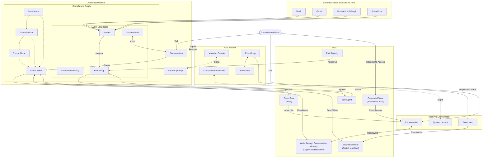

<p align="center">
  
</p>

<p align="center">
  <a href="README.md">English</a> |
  <a href="docs/i18n/zh-CN.md">简体中文</a> |
  <a href="docs/i18n/es.md">Español</a> |
  <a href="docs/i18n/hi.md">हिन्दी</a> |
  <a href="docs/i18n/pt.md">Português</a> |
  <a href="docs/i18n/ja.md">日本語</a> |
  <a href="docs/i18n/ru.md">Русский</a> |
  <a href="docs/i18n/ko.md">한국어</a>
</p>

<p align="center">
  <a href="LICENSE"></a>
  
</p>

<p align="center">
  
  
  
  
  
</p>
<p align="center">
  
  
  
</p>

## Overview

Sentinel is a self-healing enterprise compliance monitoring agent powered by [Airia](https://airia.com). Describe your compliance policy in plain English ("Monitor all Slack and email communications for GDPR violations and auto-draft incident reports"), and Sentinel generates a full multi-agent graph, deploys it, monitors failures using Airia's reasoning, and rewrites failing detection nodes automatically.

The architecture uses a two-tier Airia strategy:
- **Airia Pro (Orchestrator)** — drives the queen agent for graph generation, failure reasoning, and self-healing with extended context for holding the full compliance graph and violation history in memory
- **Airia Fast (Workers)** — powers high-throughput worker nodes for cost-efficient monitoring at scale

When detection logic fails or produces false positives, Sentinel captures failure data, evolves the agent through the Airia Pro orchestrator, and redeploys. Built-in human-in-the-loop nodes, credential management, and real-time monitoring give compliance teams control without sacrificing adaptability.

## Who Is Sentinel For?

Sentinel is designed for compliance teams and developers who want to build **production-grade AI compliance agents** powered by Airia without manually wiring complex monitoring workflows.

Sentinel is a good fit if you:

- Want AI agents that **monitor real business communications** across Slack, Gmail, Outlook, and SharePoint
- Need **fast or high-volume compliance scanning** with Airia Fast cost efficiency
- Need **self-healing and adaptive detection** that improves over time using Airia Pro reasoning
- Require **human-in-the-loop control** for ambiguous violation cases, observability, and cost limits
- Plan to run compliance monitoring in **production enterprise environments**

Sentinel may not be the best fit if you're only experimenting with simple compliance checklists or one-off scripts.

## When Should You Use Sentinel?

Use Sentinel when you need:

- Long-running, autonomous compliance monitoring powered by Airia
- Strong guardrails, audit trails, and regulatory controls
- Continuous improvement based on detection failures with Airia Pro reasoning
- Multi-agent coordination with cost-optimized Airia Fast workers
- A compliance framework that evolves with your regulatory requirements

## Airia Integration

Sentinel deeply integrates Airia at every layer, leveraging Airia's enterprise communication integrations:

| Layer | Model | Purpose |
|-------|-------|---------|
| Orchestrator (Queen Agent) | **Airia Pro** | Graph generation, failure reasoning, self-healing, extended context for full compliance graph + violation history |
| Worker Nodes | **Airia Fast** | High-throughput communication scanning, cost-efficient at scale |
| Context Management | **Airia Pro Extended** | Holds complete compliance graph and violation history in memory for informed decision-making |
| Classifier/Router | **Airia Lite** | Lightweight violation classification, routing decisions, GDPR/HIPAA/SOC2 labeling |

### Airia Communication Integrations

| Integration | Purpose |
|-------------|---------|
| **Slack** | Monitor channels and DMs for policy violations in real time |
| **Gmail** | Scan outbound and inbound email communications |
| **Outlook / Microsoft Graph** | Monitor Microsoft 365 email and calendar data |
| **SharePoint** | Scan document libraries for sensitive data exposure |
| **Microsoft Teams** | Monitor team chat and meeting transcripts |

## Quick Links

- **[Documentation](docs/)** - Complete guides and API reference
- **[Changelog](CHANGELOG.md)** - Latest updates and releases
- **[Roadmap](docs/roadmap.md)** - Upcoming features and plans
- **[Contributing](CONTRIBUTING.md)** - How to contribute and submit PRs

## Quick Start

### Prerequisites

- Python 3.11+ for agent development
- Airia API access (contact [airia.com](https://airia.com) for enterprise credentials)
- **ripgrep (optional, recommended on Windows):** The `search_files` tool uses ripgrep for faster file search.

> **Note for Windows Users:** It is strongly recommended to use **WSL (Windows Subsystem for Linux)** or **Git Bash** to run this framework.

### Installation

```bash
# Clone the repository
git clone https://github.com/Agentscreator/sentinel-airia-agent.git
cd sentinel-airia-agent

# Run quickstart setup
./quickstart.sh
```

This sets up:

- **framework** - Core agent runtime and graph executor (in `core/.venv`)
- **sentinel_tools** - MCP tools for agent capabilities (in `tools/.venv`)
- **credential store** - Encrypted API key storage (`~/.sentinel/credentials`)
- **LLM provider** - Airia model configuration
- All required Python dependencies with `uv`

> **Tip:** To reopen the dashboard later, run `sentinel open` from the project directory.

### Build Your First Compliance Agent

Type the compliance policy you want to monitor in the home input box. The Airia Pro orchestrator will design the agent graph, generate the detection code, and validate it against your policy.

### Run Agents

Select a compliance agent and click Run. The Airia Pro orchestrator manages the lifecycle while Airia Fast workers scan communications cost-efficiently.

## Features

- **Communication Monitoring** - Connect to Slack, Gmail, Outlook, SharePoint, and Microsoft Graph via Airia's native integrations
- **Parallel Scanning** - Execute the generated compliance graph in parallel with Airia Fast workers completing jobs concurrently
- **[Goal-Driven Generation](docs/key_concepts/goals_outcome.md)** - Define compliance policies in natural language; the Airia Pro orchestrator generates the agent graph and detection logic
- **[Adaptiveness](docs/key_concepts/evolution.md)** - Framework captures false positives/negatives, calibrates using Airia Pro reasoning, and evolves the detection graph
- **[Dynamic Node Connections](docs/key_concepts/graph.md)** - No predefined edges; connection code is generated by Airia based on your compliance goals
- **SDK-Wrapped Nodes** - Every node gets shared memory, local RLM memory, monitoring, tools, and LLM access out of the box
- **[Human-in-the-Loop](docs/key_concepts/graph.md#human-in-the-loop)** - Intervention nodes that pause execution for human review of ambiguous violations with configurable timeouts and escalation
- **Auto-Draft Incident Reports** - Automatically generate compliance incident reports with violation evidence, severity, and recommended remediation
- **Real-time Observability** - WebSocket streaming for live monitoring of compliance scans, violation detections, and node-to-node communication
- **Production-Ready** - Self-hostable, built for enterprise scale and regulatory reliability

## Integration

Sentinel is built to leverage Airia's full integration ecosystem while remaining system-agnostic for tools.

- **LLM Strategy** - Airia Pro for orchestration and reasoning, Airia Fast for high-throughput compliance workers, with fallback to Airia Lite for lightweight classification tasks. Additional providers supported through LiteLLM for flexibility.
- **Business system connectivity** - Connect to all enterprise communication systems via Airia's native integrations: Slack, Gmail, Outlook, SharePoint, Microsoft Graph, and more via MCP.

## Why Sentinel

Sentinel focuses on generating compliance agents that monitor real enterprise communications using Airia's differentiated reasoning and native integrations. Instead of requiring you to manually design detection workflows, define agent interactions, and handle regulatory failures reactively, Sentinel flips the paradigm: **you describe your compliance policy, and the system builds itself** — delivering an outcome-driven, adaptive compliance experience with Airia's multi-model intelligence.

```mermaid
flowchart LR
    POLICY["Define Policy"] --> GEN["Airia Pro Generates Graph"]
    GEN --> SCAN["Airia Fast Workers Scan"]
    SCAN --> DETECT{{"Violation?"}}
    DETECT -- "Clear" --> REPORT["Auto-Draft Report"]
    DETECT -- "Ambiguous" --> HITL["Human Review (HITL)"]
    HITL --> LEARN["Airia Pro Learns"]
    REPORT --> EVOLVE["Airia Pro Evolves Graph"]
    LEARN --> EVOLVE

    POLICY -.- V1["Plain English Policy"]
    GEN -.- V2["Instant Architecture"]
    SCAN -.- V3["Slack · Gmail · Outlook · SharePoint"]
    DETECT -.- V4["LLM Classifier"]
    HITL -.- V5["Compliance Officer Review"]
    EVOLVE -.- V6["Self-Healing Detection"]

    style POLICY fill:#0066CC,stroke:#003399,stroke-width:2px,color:#fff
    style GEN fill:#0066CC,stroke:#003399,stroke-width:2px,color:#fff
    style SCAN fill:#003399,stroke:#0066CC,stroke-width:2px,color:#fff
    style DETECT fill:#fff59d,stroke:#0066CC,stroke-width:2px,color:#333
    style REPORT fill:#4caf50,stroke:#2e7d32,stroke-width:2px,color:#fff
    style HITL fill:#FF9800,stroke:#E65100,stroke-width:2px,color:#fff
    style LEARN fill:#0066CC,stroke:#003399,stroke-width:2px,color:#fff
    style EVOLVE fill:#0066CC,stroke:#003399,stroke-width:2px,color:#fff
    style V1 fill:#fff,stroke:#0066CC,stroke-width:1px,color:#003399
    style V2 fill:#fff,stroke:#0066CC,stroke-width:1px,color:#003399
    style V3 fill:#fff,stroke:#0066CC,stroke-width:1px,color:#003399
    style V4 fill:#fff,stroke:#0066CC,stroke-width:1px,color:#003399
    style V5 fill:#fff,stroke:#0066CC,stroke-width:1px,color:#003399
    style V6 fill:#fff,stroke:#0066CC,stroke-width:1px,color:#003399
```



### The Sentinel Advantage

| Traditional Compliance Tools   | Sentinel                                              |
| ------------------------------ | ----------------------------------------------------- |
| Hardcode detection rules       | Describe policies in natural language                 |
| Manual rule definition         | Airia Pro auto-generates detection graphs             |
| Reactive false positive tuning | Airia Pro reasoning for self-healing detection        |
| Single scanner, one cost       | Airia Pro (orchestrator) + Airia Fast (workers) = cost control |
| Static keyword lists           | Dynamic LLM-based violation classification            |
| Separate reporting setup       | Built-in auto-drafted incident reports                |
| DIY budget management          | Integrated cost controls & model degradation          |
| Limited context window         | Airia Pro extended context for full compliance history|

### How It Works

1. **[Define Your Policy](docs/key_concepts/goals_outcome.md)** → Describe your compliance requirement in plain English
2. **Airia Pro Orchestrator Generates** → Creates the [compliance agent graph](docs/key_concepts/graph.md), detection code, and test cases
3. **[Airia Fast Workers Scan](docs/key_concepts/worker_agent.md)** → SDK-wrapped nodes monitor Slack, Gmail, Outlook, and SharePoint with full observability
4. **LLM Classifier Detects** → Real-time violation detection with confidence scoring
5. **[HITL Review](docs/key_concepts/graph.md#human-in-the-loop)** → Ambiguous cases are paused for compliance officer review
6. **[Airia Pro Self-Heals](docs/key_concepts/evolution.md)** → On false positive/negative, Airia Pro reasons about the detection failure, evolves the graph, and redeploys automatically

## Architecture



## Contributing
We welcome contributions from the community! Please see [CONTRIBUTING.md](CONTRIBUTING.md) for guidelines.

1. Find or create an issue and get assigned
2. Fork the repository
3. Create your feature branch (`git checkout -b feature/amazing-feature`)
4. Commit your changes (`git commit -m 'Add amazing feature'`)
5. Push to the branch (`git push origin feature/amazing-feature`)
6. Open a Pull Request

## Security

For security concerns, please see [SECURITY.md](SECURITY.md).

## License

This project is licensed under the Apache License 2.0 - see the [LICENSE](LICENSE) file for details.

## Frequently Asked Questions (FAQ)

**Q: What LLM providers does Sentinel support?**

Sentinel is optimized for Airia's model family via [airia.com](https://airia.com). It also supports 100+ additional LLM providers through LiteLLM integration for flexibility, including OpenAI, Anthropic, Google Gemini, and more.

**Q: Why Airia specifically?**

Sentinel uses a two-tier model strategy: Airia Pro's extended context and reasoning capabilities power the orchestrator (graph generation, failure analysis, self-healing), while Airia Fast provides cost-efficient high-throughput execution for worker nodes. Critically, Airia provides native integrations for Slack, Gmail, Outlook, SharePoint, and Microsoft Graph — the exact communication systems compliance teams need to monitor.

**Q: Can I use Sentinel with other models?**

Yes. While optimized for Airia, the framework supports any LiteLLM-compatible model. You can mix Airia with other providers for specific nodes if needed.

**Q: What makes Sentinel different from other compliance tools?**

Sentinel generates your entire compliance monitoring system from natural language policies using an Airia Pro-powered orchestrator — you don't hardcode detection rules or manually define scanning workflows. When detection logic produces false positives or misses violations, Airia Pro reasons about the failure, evolves the agent graph, and redeploys. This self-improving loop, combined with Airia's native communication integrations, is unique.

**Q: Is Sentinel open-source?**

Yes, Sentinel is fully open-source under the Apache License 2.0.

**Q: Can Sentinel handle complex, production-scale enterprise compliance?**

Yes. Sentinel is designed for enterprise production with automatic detection improvement via Airia Pro reasoning, real-time observability, cost controls through Airia Fast workers, and horizontal scaling support across all monitored communication channels.

**Q: Does Sentinel support human-in-the-loop workflows?**

Yes, Sentinel fully supports [human-in-the-loop](docs/key_concepts/graph.md#human-in-the-loop) workflows through intervention nodes that pause execution for compliance officer review of ambiguous violations with configurable timeouts and escalation policies.

**Q: How does cost control work in Sentinel?**

Sentinel provides granular budget controls including spending limits, throttles, and automatic model degradation. The two-tier Airia strategy (Pro for orchestration, Fast for workers) inherently optimizes costs. You can set budgets at the team, compliance agent, or workflow level.

**Q: What programming languages does Sentinel support?**

The Sentinel framework is built in Python. A JavaScript/TypeScript SDK is on the roadmap.

---

<p align="center">
  Powered by Airia 🛡️
</p>
